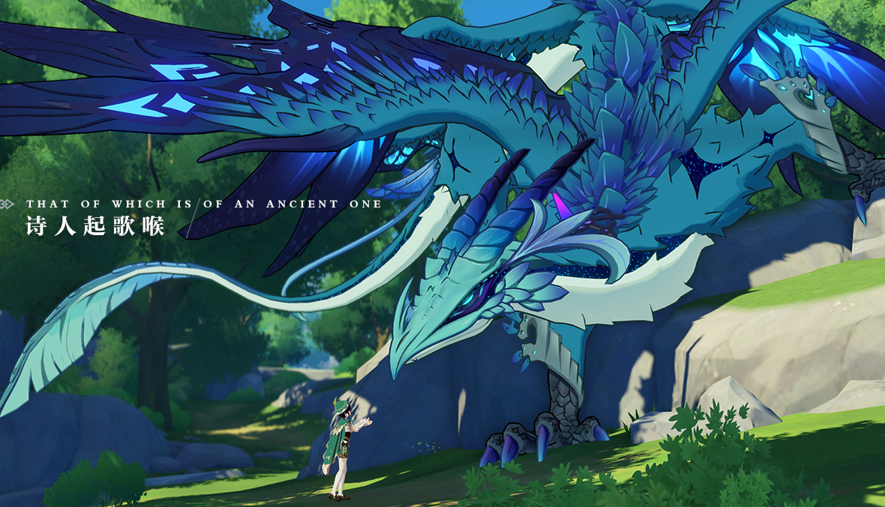

##《原神》简介：

《原神》是一款以幻想世界为背景的游戏，玩家将进入名为提瓦特（Teyvat）的奇幻大陆，探索各种风格独特的地域，每个地域都有其自己的故事和文化。玩家扮演“旅行者”，拥有能够召唤元素力量的能力，从而可以控制风、火、水、冰等元素，与各种敌人战斗并解锁游戏中的谜题。

##游戏特点：

1. **开放世界探索**：提瓦特大陆宏大而精美，玩家可以自由探索各个地区，发现隐藏的宝藏、任务和故事线。

2. **多元素战斗系统**：玩家可以在战斗中自由切换不同元素的技能，创造强大的元素组合，应对各种敌人和挑战。

3. **角色收集与培养**：游戏中有多名可玩角色，每个角色都有独特的技能和特点，玩家可以通过抽卡系统获取并提升他们。

4. **多样化任务和活动**：游戏提供了丰富的任务、副本和活动，以及定期更新的内容，让玩家不断有新的事情可做。

5. **精美的艺术风格**：游戏以梦幻般的画面和音乐为特点，呈现出令人陶醉的游戏世界。

6. **多人合作**：玩家可以与其他玩家组队合作，共同探索世界、挑战副本和击败强大的敌人。

##人气角色：

在《原神》中，有众多受欢迎的角色，每个角色都有自己的故事和精彩的技能，例如主人公旅行者、迪卢克、莫娜、芭芭拉等等。这些角色都有着独特的性格和魅力，吸引了玩家们的喜爱。

##游戏截图

